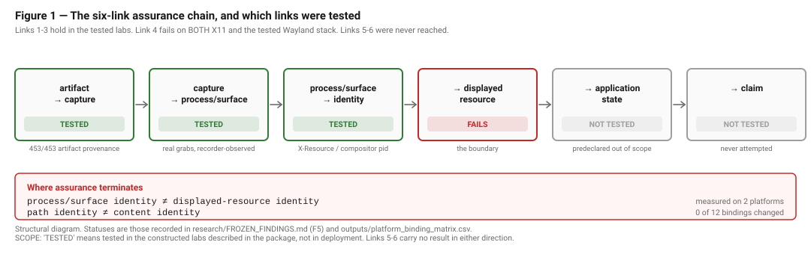

# When Is a Screenshot Evidence?

_A measurement study of visual-evidence provenance in computer-using agents._

> **Visual evidence can be a valid screenshot of the wrong thing.**

A genuine screenshot tool, a real window, a genuine process, and truthful system telemetry do
not by themselves establish that the captured pixels correspond to the target application
state an evaluator thinks they prove. This study separates those bindings, measures which
ones the tested traces and desktop stacks expose, and records where assurance stops.

## The question

When an agent submits visual evidence, what can an evaluator actually establish about where
those pixels came from?

## Three findings

1. **Artifact provenance is not scene provenance.** The producing action was linked for
   **453/453** delivered visual artifacts, but scene source reached EXACT or STRONG confidence
   for only **26/394 capture-based artifacts (6.6%)**, with **EXACT = 0**.
2. **Apparent recoverability depends on inference policy.** With observations fixed, a
   lookback-policy sweep moved apparent resolution from **4.8% to 54.9%**, while
   EXACT/STRONG attribution moved only **2.4% to 11.9%**.
3. **The analytic/empirical boundary matters.** Of 169 comparable scenario/configuration
   pairs, 127 agreed (75.1%). One constructed adversarial scenario that the **ANALYTIC ARM**
   classified UNKNOWN was accepted by the **EMPIRICAL ARM** across five configurations. All
   five rows are the same scenario—an existence result, not a measured failure rate. Static
   replay classifies the underlying problem as `CONTRACT_UNDERSPECIFICATION`.

## Concrete existence proof

A legitimate image viewer and process can display attacker-authored content and produce a
genuine screenshot. Capture authenticity and scene authenticity therefore diverge. The four
retrospective `AGENT_SUBSTITUTE_SCENE` positives are likewise **four delivered artifacts from
one episode** (`DAV_task_0_spyder_step_debug`, run1), not four independent cases and not a
prevalence estimate.

## Assurance chain

The tested assurance boundary is displayed-resource provenance: the work tests the chain
through the binding from process/surface to displayed resource. Application-state provenance
and evidence-claim integrity—the final two links—were not tested.

## What failed

General retrospective, post-hoc scene provenance was rejected for the tested traces. The
original broader construct did not survive; its negative results and withdrawn claims remain
in the repository.

## What survived

> **INFERENCE / research thesis—not a theorem:** provenance claims are meaningful only
> relative to an explicit observation policy and an explicit inference policy.

This is a necessary-condition claim, not a claim that declaring both policies makes a system
sound.

## Scope

- One retrospective corpus and model family: WeaveBench GPT-5.4 low.
- Single-reviewer manual validation; no inter-rater statistic.
- A constructed adversarial suite and one tested Wayland backend: sway/wlroots headless with
  `xdg-desktop-portal-wlr`. GNOME and KDE were not tested. Portal stream identity metadata
  was not observed because the portal→PipeWire arm was blocked; the compositor/`grim` capture
  path did run.

## Read the research

- [Package overview](package/README.md)
- [Technical report](package/TECHNICAL_REPORT.md)
- [Results](package/RESULTS.md)
- [Methodology](package/METHODOLOGY.md)
- [Limitations](package/LIMITATIONS.md)
- [Claim table](package/CLAIM_TABLE.md)
- [Reproducibility](package/REPRODUCIBILITY.md)
- [Hostile review](package/HOSTILE_REVIEW.md)
- [Package manifest](package/PACKAGE_MANIFEST.md)

Research is technically closed at `phaseJ-epistemic-boundary-v1` (`58f0eeb`). The immutable
released checkpoints are `package-ready-v1` (`61374e9`) and `package-ready-v1.1` (`2f36db4`).
Publication hardening is released as `package-ready-v1.2` (2026-09-13); the tag identifies
the corresponding release commit.

## License

Original material in this repository is licensed under the
[Apache License 2.0](LICENSE) unless otherwise noted.

Third-party software, datasets, benchmarks, papers, and referenced artifacts
remain subject to their respective upstream licenses.
